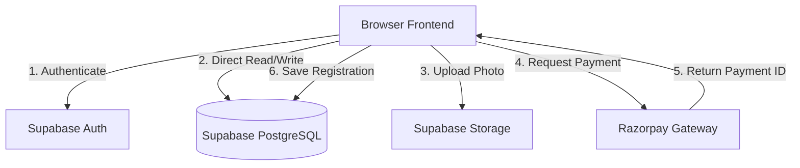

# ASL — Backend Working Flow & Proposed Security Updates

This document maps out the backend architecture of the Abstream Sports League (ASL) web application, highlights security vulnerabilities in the current prototype, and proposes specific backend updates to secure the site for production.

---

## 1. Current Working Flow

The system is a decoupled architecture using a lightweight Node.js helper server, direct Supabase client integration (Auth, Database, Storage), and Razorpay payments.



### Key Workflows:
1. **Registration & Fee Payment**:
   * Frontend calculates fee using `js/register.js`.
   * Triggers Razorpay Checkout window directly from the browser.
   * If payment succeeds, a record is inserted into the `registrations` table in Supabase.
2. **Leaderboards & Match Recording**:
   * Admin enters a match result in `admin-dashboard.html`.
   * Result is saved in the `match_history` table.
   * A Postgres Database Trigger (`trigger_update_player_stats`) updates the player's matches, wins, and points.
   * A second Trigger (`trigger_recalculate_ranks`) automatically updates the `rank` attribute for all players, sorting by points descending.

---

## 2. Identified Backend Vulnerabilities

During security auditing, the following issues were identified in the current setup:

| Area | Vulnerability | Severity | Impact |
| :--- | :--- | :--- | :--- |
| **Payments** | Client-Side Fee Calculation & Direct Database Writes | **CRITICAL** | Users can edit the JS variable values to register for ₹1 instead of the actual price, or bypass payments entirely by calling the database success insertion function directly. |
| **Auth** | Admin Privilege Escalation (RLS Bypass) | **CRITICAL** | The `admins` table has a `WITH CHECK (true)` insert policy. A normal user can insert their Auth UUID into `admins` using the browser console and grant themselves Admin rights. |
| **Privacy** | Public Read Access on Registrations | **HIGH** | The `registrations` table policy allows `USING (true)` for reading. Any user can fetch the personal info (phone, email, employee ID) of all other registrants. |
| **Reliability** | No Payment Webhooks | **MEDIUM** | If a user pays but closes their tab before the database save completes, their payment is processed but the registration is lost. |

---

## 3. Proposed Backend Updates

To transition this site to a production-ready application, the following updates are recommended:

### A. Secure Razorpay Integration (via dev server API)
Introduce secure server-side routes in `server.js` using the Razorpay Node SDK. 

1. **Order Creation Endpoint**:
   ```javascript
   // Add to server.js
   const Razorpay = require('razorpay');
   const razorpay = new Razorpay({
     key_id: process.env.RAZORPAY_KEY_ID,
     key_secret: process.env.RAZORPAY_KEY_SECRET // Kept secure on backend
   });

   app.post('/api/create-order', express.json(), async (req, res) => {
     try {
       const { sport, type, categories } = req.body;
       // 1. Recalculate amount SECURELY on backend
       const amount = calculateFeesOnBackend(sport, type, categories);
       
       // 2. Create Razorpay Order
       const order = await razorpay.orders.create({
         amount: amount * 100, // in paise
         currency: 'INR',
         receipt: `receipt_${Date.now()}`
       });
       res.json({ orderId: order.id, amount: order.amount });
     } catch (err) {
       res.status(500).json({ error: err.message });
     }
   });
   ```

2. **Signature Verification Endpoint**:
   ```javascript
   const crypto = require('crypto');

   app.post('/api/verify-payment', express.json(), async (req, res) => {
     const { razorpay_order_id, razorpay_payment_id, razorpay_signature } = req.body;
     
     // Verify signature: hmac_sha256(order_id + "|" + payment_id, secret)
     const generated_signature = crypto
       .createHmac('sha256', process.env.RAZORPAY_KEY_SECRET)
       .update(razorpay_order_id + "|" + razorpay_payment_id)
       .digest('hex');

     if (generated_signature === razorpay_signature) {
       // Payment is genuine! Save to Supabase using service_role key
       res.json({ status: 'verified' });
     } else {
       res.status(400).json({ error: 'Invalid transaction signature' });
     }
   });
   ```

---

### B. Secure Database RLS Policies (`supabase-schema.sql`)
Update RLS policies to close the privilege escalation and data leak routes.

```sql
-- 1. Restrict registrations read policy to own email only
DROP POLICY IF EXISTS "registrations: own read" ON registrations;
CREATE POLICY "registrations: own read" ON registrations
  FOR SELECT USING (
    email = auth.jwt()->>'email' OR 
    EXISTS (SELECT 1 FROM admins WHERE admins.id = auth.uid())
  );

-- 2. Restrict admins table insertion (Prevent self-promotion)
DROP POLICY IF EXISTS "admins: insert on signup" ON admins;
CREATE POLICY "admins: insert on signup" ON admins
  FOR INSERT WITH CHECK (
    -- Only allow if they supply the correct server-side verified credentials 
    -- Or use a secure database setup procedure instead of public signup
    false 
  );

-- 3. Enforce auth_id checks on player profile creation
DROP POLICY IF EXISTS "players: insert on signup" ON players;
CREATE POLICY "players: insert on signup" ON players
  FOR INSERT WITH CHECK (
    auth.uid() = auth_id
  );
```

---

### C. Razorpay Webhooks
Add a webhook route to `server.js` that listens to `payment.captured` event notifications directly from Razorpay.

```javascript
app.post('/api/webhooks/razorpay', express.raw({ type: 'application/json' }), (req, res) => {
  const secret = process.env.RAZORPAY_WEBHOOK_SECRET;
  const signature = req.headers['x-razorpay-signature'];

  // Validate webhook signature
  const hmac = crypto.createHmac('sha256', secret);
  hmac.update(req.body);
  const generatedSignature = hmac.digest('hex');

  if (generatedSignature === signature) {
    const event = JSON.parse(req.body);
    if (event.event === 'payment.captured') {
      const paymentDetails = event.payload.payment.entity;
      // Asynchronously ensure registration exists in Supabase
      saveToDatabase(paymentDetails);
    }
    res.json({ status: 'ok' });
  } else {
    res.status(400).send('Invalid signature');
  }
});
```
